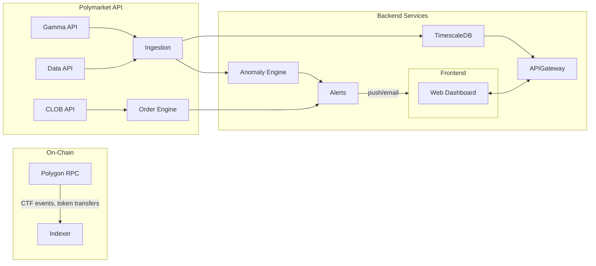

# Polymarket Whale Tracker

An automated bot that monitors [Polymarket](https://polymarket.com) prediction markets, detects **large-money moves (>$100k)** using Claude AI, and alerts you via **Telegram** and **Email** in real time.

The long-term vision is a full **copy-trading platform for prediction markets**: anomaly detection, insider-trading signals, and automatic order execution via the Polymarket CLOB API.

---

## How It Works Today

```
Daily at 09:00 and 21:00 UTC — GitHub Actions scheduled
        ↓
Build Gamma resolution cache (1000 active + 500 recently-closed markets)
        ↓
Download top-trader leaderboard from Polymarket Data API
        ↓
Filter trades: sports / expired dates / resolved markets / wash trading
        ↓
Claude AI analyzes up to 10 moves with whale context + track record
        ↓
Telegram + Email notifications only for COPY and WATCH (never SKIP)
        ↓
Commit whale_state.json + update GitHub Pages dashboard
```

---

## Filter Chain

| Layer | Filter | Detail |
|-------|--------|--------|
| 1 | Sport | 100+ keyword blocklist + regex patterns (e.g. "Will X win on YYYY-MM-DD?") |
| 2a | Expired date (text) | Regex on months/quarters/years in the market title |
| 2b | Resolved market (Gamma API) | Bulk cache of 1 500 markets, 3-tier lookup (exact → 40-char partial → search) |
| 2c | Structured end date | `endDate` API field vs today UTC |
| 3 | Wash trading | Wallets that repeatedly buy and sell the same position are excluded |

---

## Setup (one-time)

### Step 1 — GitHub Secrets
Go to **Settings → Secrets and variables → Actions** and add:

| Secret | Value |
|--------|-------|
| `ANTHROPIC_API_KEY` | Your Anthropic API key ([console.anthropic.com](https://console.anthropic.com)) |
| `TELEGRAM_BOT_TOKEN` | Your Telegram bot token |
| `TELEGRAM_CHAT_ID` | Your Telegram User ID (get via @userinfobot) |
| `GMAIL_APP_PASSWORD` | Gmail App Password (see Step 2) |

### Step 2 — Gmail App Password
1. [myaccount.google.com](https://myaccount.google.com) → **Security** → enable 2-Step Verification
2. Search **"App passwords"** → create one (name: "Polymarket Bot")
3. Copy the 16-char code, add it as `GMAIL_APP_PASSWORD` secret (no spaces)

### Step 3 — Web Dashboard (free)
1. **Settings → Pages** → Source: **Deploy from branch** → `main` → `/ (root)`
2. After 1-2 minutes your dashboard is live at `https://<user>.github.io/<repo>`

### Step 4 — Manual Test
**Actions → "Whale Tracker" → "Run workflow"** — ~2 minutes → Telegram + Email.

---

## Verdict System

| Verdict | Meaning |
|---------|---------|
| COPY | Strong signal — price looks clearly mispriced |
| WATCH | Interesting — monitor for confirmation |
| SKIP | Not worth it, too risky, or sports/expired market |

Only **COPY** and **WATCH** trigger a notification. SKIPs are silent.

---

## Architecture (current)

```
┌─────────────────────────────────────────────────────────┐
│  GitHub Actions (cron 09:00 + 21:00 UTC)                │
│                                                         │
│  whale_tracker.py                                       │
│  ├── build_gamma_resolution_cache()  ← Gamma API       │
│  ├── fetch_breaking_leaderboard()    ← Data API        │
│  ├── fetch_whale_trades()            ← Data API        │
│  │   └── filter chain (sport/date/resolved/wash)       │
│  ├── analyze_with_claude()           ← Anthropic API   │
│  ├── send_telegram() + send_email()                     │
│  └── save_state()  →  whale_state.json  →  Pages       │
└─────────────────────────────────────────────────────────┘
```

---

## Planned Architecture (roadmap)



---

## Roadmap

| Sprint | Focus | Key deliverables |
|--------|-------|-----------------|
| **MVP (now)** | Whale detection + AI signals | Claude analysis, filter chain, GitHub Pages dashboard |
| **Sprint 1** | Data pipeline | TimescaleDB, WebSocket live feed, Polygon RPC sync |
| **Sprint 2** | Analytics engine | Isolation Forest anomaly detection, wallet clustering (coordinated buys) |
| **Sprint 3** | Copy trading | CLOB API order execution, proportional sizing, slippage control |
| **Sprint 4** | Security + UX | AES-256 key management / WalletConnect, immutable audit trail |

---

## API Reference

| API | Purpose | Auth |
|-----|---------|------|
| Gamma API | Markets, events, resolution status | Public |
| Data API | Positions, trades, leaderboard | Public |
| CLOB API | Order placement / cancellation | API key (future) |
| Polygon RPC | On-chain event verification (future) | Provider (Alchemy/Infura) |

---

## Project Structure

```
whale_tracker.py          Core logic: leaderboard, Claude analysis, notifications
poly_live.py              H24 live monitoring via WebSocket (for VPS/server)
whale_state.json          Persistent state (leaderboard, recent bets, accuracy)
index.html                Web dashboard (GitHub Pages)
tests/
  test_whale_tracker.py   46 pytest tests (sport filter, date filter, resolution)
.github/workflows/
  main.yml                GitHub Actions (cron + manual trigger)
requirements.txt          Python dependencies
```

---

## Configuration

| Variable | Default | Description |
|----------|---------|-------------|
| `MAX_WHALES` | `10` | Markets analyzed per run |
| `MIN_SIZE_USDC` | `100000` | Minimum trade size to consider ($) |

---

## Troubleshooting

| Problem | Solution |
|---------|----------|
| No Telegram message | Check `TELEGRAM_BOT_TOKEN` and `TELEGRAM_CHAT_ID` secrets |
| No email | Check `GMAIL_APP_PASSWORD` in secrets |
| Expired market still notified | Open an issue — the multi-layer filter should catch it |
| Dashboard not updating | Wait for the next scheduled run (it commits `whale_state.json`) |
| Accuracy always N/A | Normal at first — populates as COPY markets resolve over weeks |
| Workflow delayed | GitHub Actions cron can be late up to 15 min — expected behavior |

---

> **Disclaimer**: Trading on Polymarket involves significant risk. This tool provides signals based on observable whale activity, but the final decision is always yours. Never invest money you cannot afford to lose.
